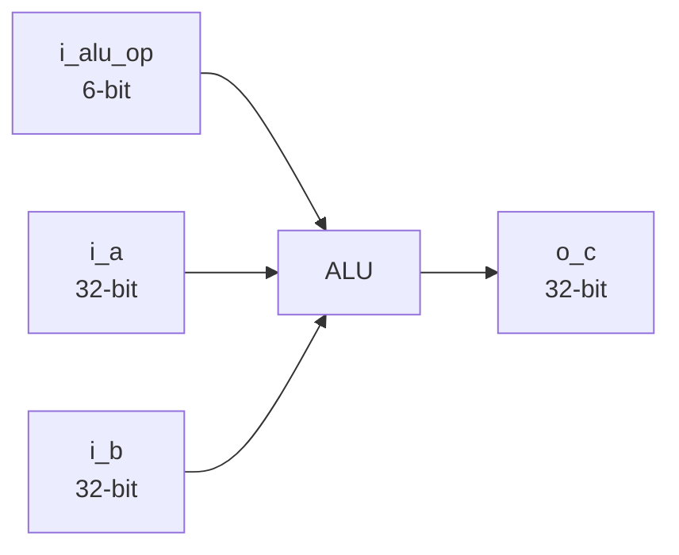
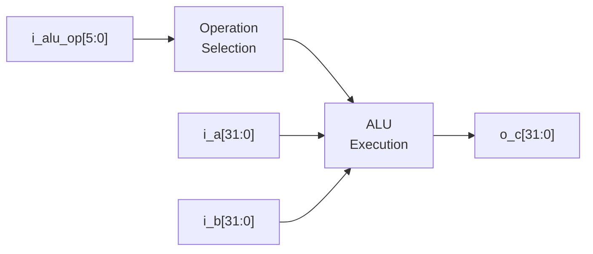
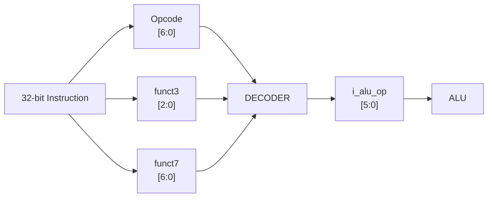
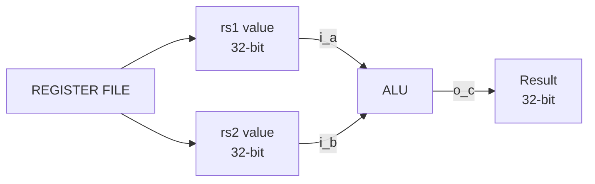
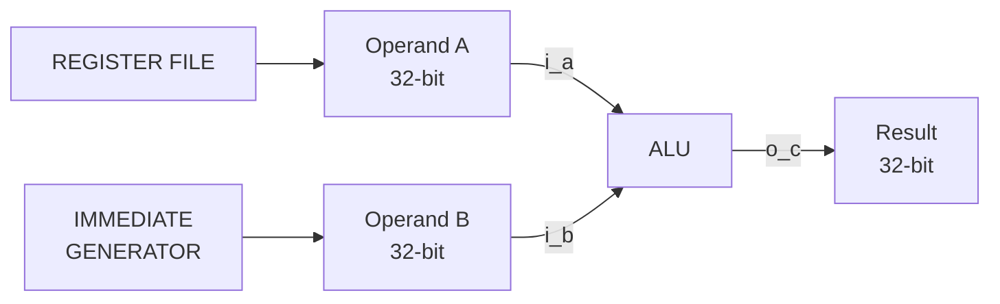
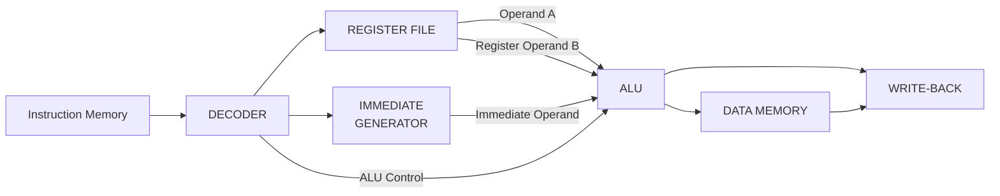
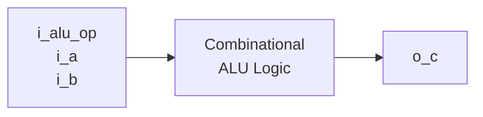
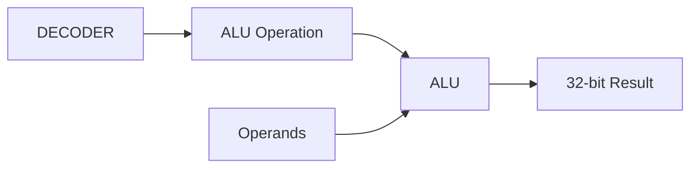

# Arithmetic Logic Unit (ALU)

The Arithmetic Logic Unit (ALU) is a 32-bit combinational component of the RV32I processor. It performs the arithmetic, logical, comparison, and shift operations required by the processor's instruction set.

The operation performed by the ALU is selected using a 6-bit control input generated by the decoder.

---

## Block Diagram



The ALU has two 32-bit data inputs, one 6-bit operation-control input, and one 32-bit result output.

---

## Interface

| Signal     |   Width | Direction | Description             |
| ---------- | ------: | --------- | ----------------------- |
| `i_alu_op` |  6 bits | Input     | ALU operation selection |
| `i_a`      | 32 bits | Input     | First operand           |
| `i_b`      | 32 bits | Input     | Second operand          |
| `o_c`      | 32 bits | Output    | ALU result              |

---

## Signal Flow



`i_alu_op` determines which operation is applied to `i_a` and `i_b`.

---

## ALU Control

The `i_alu_op` signal is 6 bits wide:

```text
i_alu_op[5:0]
```

It provides the operation encoding used by the ALU.

The decoder determines the required ALU operation from the instruction fields and supplies the corresponding control value to the ALU.



---

## ALU Datapath

The two operands are supplied through `i_a` and `i_b`.

For register-register operations, both operands can originate from the register file.



For immediate-based operations, the second operand can be supplied by the immediate-generation path.



---

## Processor-Level Connection

Within the RV32I processor, the ALU operates between the operand-generation stage and the result-consuming stages of the datapath.



The exact datapath connection depends on the instruction being executed.

---

## Combinational Operation

The ALU is a combinational block. Its output is determined directly by the current values of its inputs:



There is no clock or internal sequential storage inside the ALU.

---

## Module

The ALU is implemented as a standalone Verilog module:

```text
rtl/
└── ALU.v
```

Its corresponding verification environment is:

```text
tb/
└── ALU_tb.v
```

The ALU can therefore be simulated independently before being connected to the complete RV32I processor datapath.

---

## Design Parameters

| Parameter              | Value         |
| ---------------------- | ------------- |
| ISA                    | RISC-V RV32I  |
| Operand width          | 32 bits       |
| Result width           | 32 bits       |
| ALU control width      | 6 bits        |
| Logic type             | Combinational |
| HDL                    | Verilog       |
| Primary control source | Decoder       |

---

## Role in RV32I

The ALU provides the execution logic required by the processor. Its result may be used for:

* Integer arithmetic
* Logical operations
* Comparisons
* Shift operations
* Effective address calculation
* Branch-related calculations
* Other datapath operations requiring ALU computation

The decoder selects the operation, the datapath supplies the operands, and the ALU produces the resulting 32-bit value.



