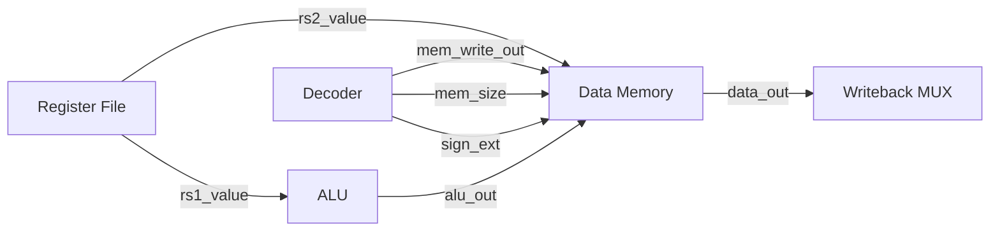
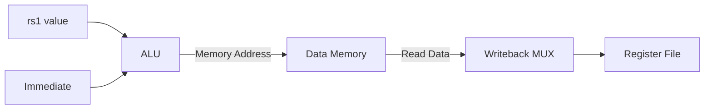
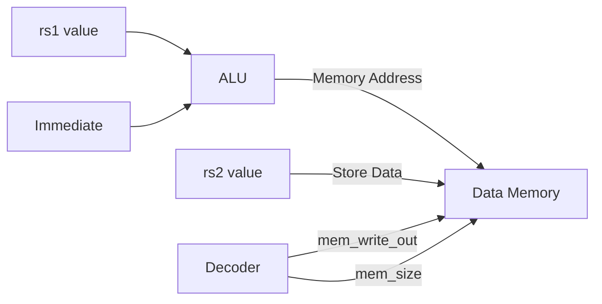
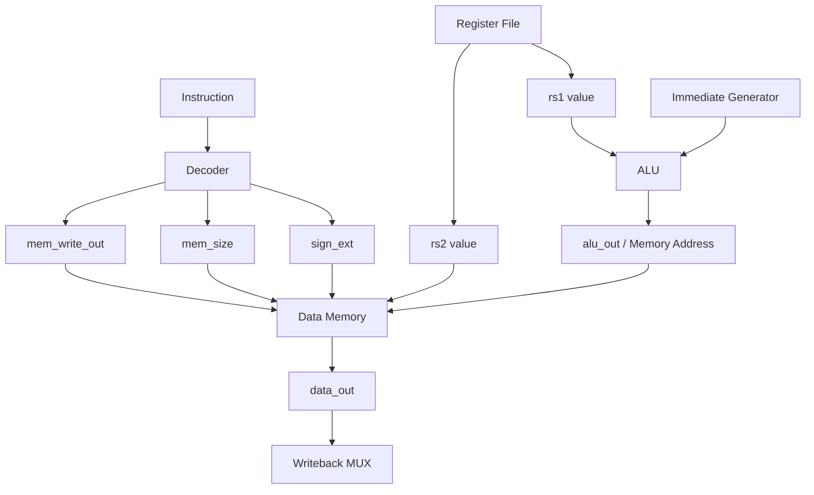

# Data Memory

The **Data Memory** module is responsible for reading and writing data for load and store instructions in the RV32I single-cycle processor.

It uses the address generated by the ALU, the value from `rs2` for store operations, and control signals from the Decoder to determine the memory operation.

## Supported Instructions

### Load Instructions

| Instruction | Operation | Size | Extension |
|---|---|---|---|
| `LB` | Load byte | 8 bits | Sign extension |
| `LH` | Load halfword | 16 bits | Sign extension |
| `LW` | Load word | 32 bits | No extension |
| `LBU` | Load byte | 8 bits | Zero extension |
| `LHU` | Load halfword | 16 bits | Zero extension |

### Store Instructions

| Instruction | Operation | Size |
|---|---|---|
| `SB` | Store byte | 8 bits |
| `SH` | Store halfword | 16 bits |
| `SW` | Store word | 32 bits |

## Module Interface

```verilog
module DATA_MEMORY(
    input wire clk,
    input wire mem_write_out,
    input wire [1:0] mem_size,
    input wire sign_ext,
    input wire [31:0] rs2_value,
    input wire [31:0] alu_out,
    output reg [31:0] data_out
);
```

## Inputs

| Signal | Width | Description |
|---|---:|---|
| `clk` | 1 bit | Clock used for store operations |
| `mem_write_out` | 1 bit | Enables memory write for store instructions |
| `mem_size` | 2 bits | Selects byte, halfword, or word access |
| `sign_ext` | 1 bit | Selects signed or unsigned load extension |
| `rs2_value` | 32 bits | Data written to memory during store operations |
| `alu_out` | 32 bits | Memory address generated by the ALU |

## Output

| Signal | Width | Description |
|---|---:|---|
| `data_out` | 32 bits | Data read from memory during load operations |

## Memory Organization

The memory is implemented as a byte-addressable memory array:

```verilog
reg [7:0] memory [0:1023];
```

Each memory location stores 8 bits.

Therefore:

```text
Byte       → 1 memory location
Halfword   → 2 memory locations
Word       → 4 memory locations
```

The memory uses little-endian byte ordering.

For example, storing:

```text
0x12345678
```

at address `A` results in:

```text
memory[A]     = 0x78
memory[A + 1] = 0x56
memory[A + 2] = 0x34
memory[A + 3] = 0x12
```

## Memory Size Selection

The `mem_size` control signal determines the number of bytes accessed.

```text
00 → Byte
01 → Halfword
10 → Word
```

The instruction mapping is:

| Instruction | `mem_size` |
|---|---:|
| `LB` | `00` |
| `LBU` | `00` |
| `LH` | `01` |
| `LHU` | `01` |
| `LW` | `10` |
| `SB` | `00` |
| `SH` | `01` |
| `SW` | `10` |

## Store Operation

When:

```text
mem_write_out = 1
```

the module performs a store operation.

### SB

Stores the lower 8 bits of `rs2_value`:

```text
memory[alu_out] = rs2_value[7:0]
```

### SH

Stores 16 bits across two consecutive memory locations:

```text
memory[alu_out]     = rs2_value[7:0]
memory[alu_out + 1] = rs2_value[15:8]
```

### SW

Stores 32 bits across four consecutive memory locations:

```text
memory[alu_out]     = rs2_value[7:0]
memory[alu_out + 1] = rs2_value[15:8]
memory[alu_out + 2] = rs2_value[23:16]
memory[alu_out + 3] = rs2_value[31:24]
```

## Load Operation

When:

```text
mem_write_out = 0
```

the module performs the read operation used by load instructions.

The selected memory bytes are combined into a 32-bit result and assigned to `data_out`.

### LB / LBU

One byte is read:

```text
memory[alu_out]
```

For signed loading:

```text
sign_ext = 1
```

the most significant bit of the byte is replicated to form a 32-bit signed value.

For unsigned loading:

```text
sign_ext = 0
```

the byte is zero-extended to 32 bits.

### LH / LHU

Two bytes are read:

```text
memory[alu_out]
memory[alu_out + 1]
```

The resulting 16-bit value is either:

```text
Sign-extended
```

or:

```text
Zero-extended
```

depending on `sign_ext`.

### LW

Four consecutive bytes are combined to form the complete 32-bit word.

No extension is required for a word load.

## Sign Extension Control

The `sign_ext` signal determines how byte and halfword loads are extended.

```text
sign_ext = 1 → Sign extension
sign_ext = 0 → Zero extension
```

The mapping is:

| Instruction | `sign_ext` |
|---|---:|
| `LB` | `1` |
| `LH` | `1` |
| `LW` | Not required |
| `LBU` | `0` |
| `LHU` | `0` |

`sign_ext` has no effect on store instructions.

## Datapath Role

The Data Memory receives its address from the ALU and store data from the Register File.



## Load Datapath



For a load instruction:

```text
rs1 + immediate
        ↓
       ALU
        ↓
   memory address
        ↓
   Data Memory
        ↓
     data_out
        ↓
 Writeback MUX
        ↓
   Register File
```

## Store Datapath



For a store instruction:

```text
rs1 + immediate
        ↓
       ALU
        ↓
   memory address
        ↓
   Data Memory
        ↑
     rs2 value
```

## Overall Data Memory Operation



## Verification

The associated testbench verifies:

- `SB`
- `SH`
- `SW`
- `LB`
- `LH`
- `LW`
- `LBU`
- `LHU`
- Signed byte loading
- Unsigned byte loading
- Signed halfword loading
- Unsigned halfword loading
- Word loading
- Little-endian storage
- Multiple-byte memory accesses

The Data Memory is verified independently before being integrated into the complete RV32I single-cycle processor.
