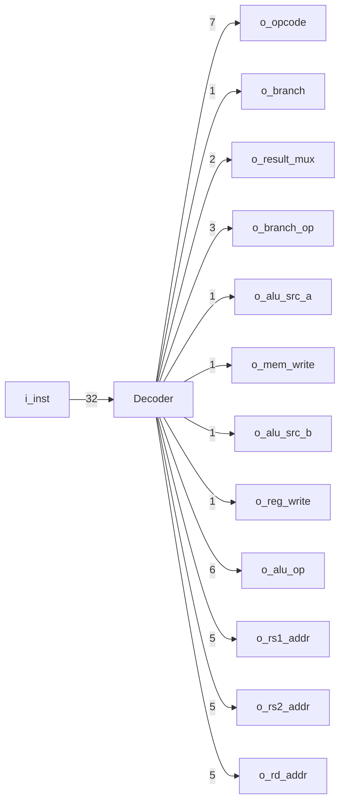
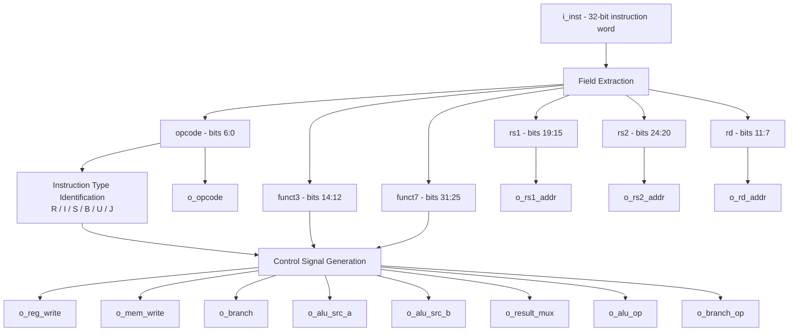
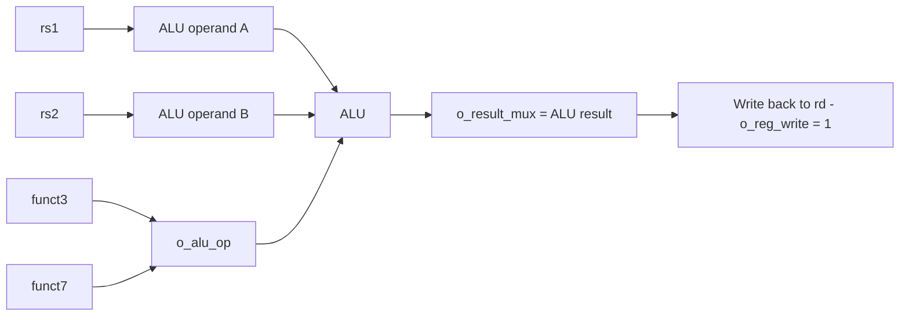
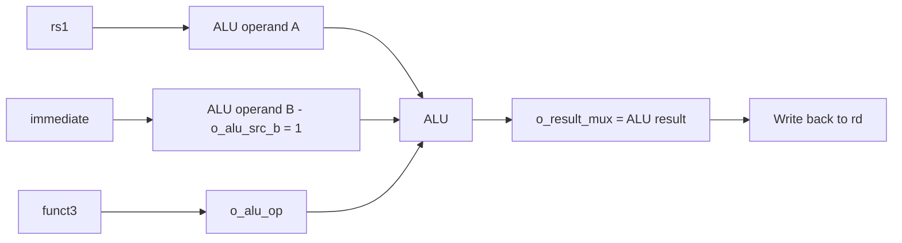
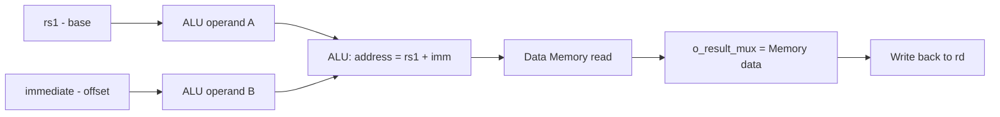
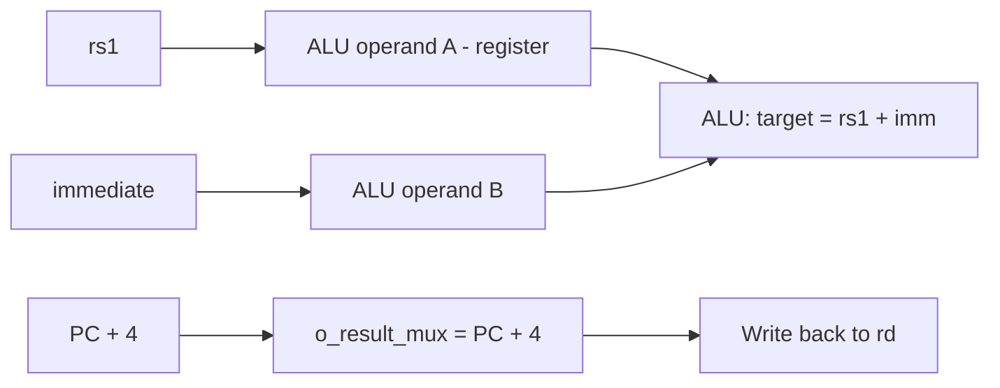
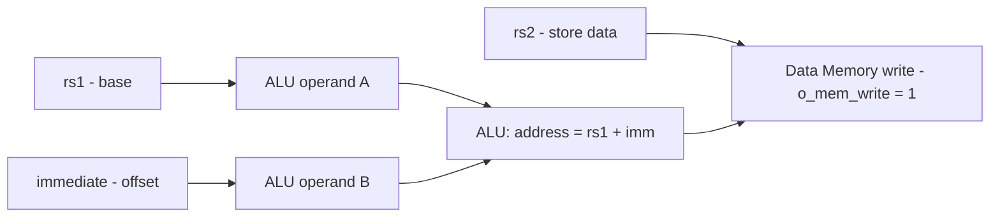
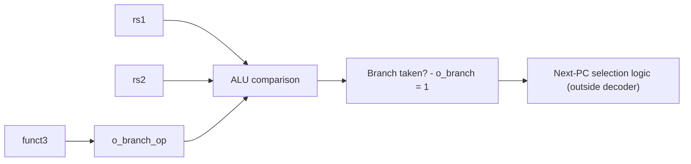
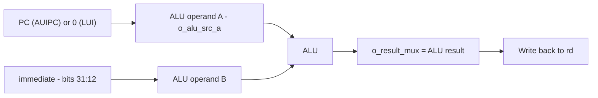
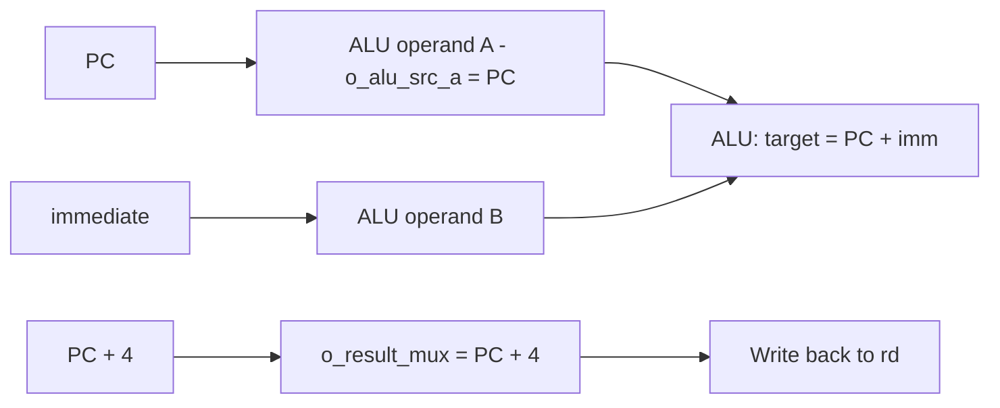

# RV32I Instruction Decoder

**The control-signal generator of the processor — turns a raw 32-bit instruction word into every signal the rest of the datapath needs to execute it.**

---

## Overview

The **Decoder** is a purely combinational module. It takes the 32-bit instruction fetched from memory (`i_inst`) and, in the same cycle, produces:

- The register addresses (`rs1`, `rs2`, `rd`) that the Register File should read/write.
- The control signals that steer the ALU, the memory interface, and the write-back multiplexer.
- The information the branch-resolution logic needs to know *whether* a branch is possible and *which* condition to check.

It does not perform any computation itself — it only *interprets* the instruction and routes the correct control values to the rest of the processor.

Since RV32I organizes every instruction into one of six fixed formats (R, I, S, B, U, J), the decoding logic naturally splits along the same lines. This repository documents — and is intended to hold — that logic on a per-format basis.

---

## Folder Structure

```
decoder/
├── decoder.v              # Top-level decoder — combines every instruction-type
│                           # decode path into the final set of control signals
├── r_type_decoder.v       # R-type (register-register) decode logic
├── i_type_decoder.v       # I-type decode logic (arithmetic, loads, JALR)
├── s_type_decoder.v       # S-type (store) decode logic
├── b_type_decoder.v       # B-type (branch) decode logic
├── u_type_decoder.v       # U-type (LUI, AUIPC) decode logic
├── j_type_decoder.v       # J-type (JAL) decode logic
└── README.md              # This file
```

> This layout mirrors the six RV32I instruction formats one-to-one, so each file documented below maps directly onto a section of this README.

---

## Port Interface

| Signal | Direction | Width | Purpose |
|---|---|---|---|
| `i_inst` | Input | 32 | The full instruction word fetched from Instruction Memory |
| `o_opcode` | Output | 7 | The instruction's opcode field (`i_inst[6:0]`), passed out for use by downstream logic |
| `o_branch` | Output | 1 | Asserted when the instruction is a conditional branch (B-type) |
| `o_result_mux` | Output | 2 | Selects what gets written back to `rd`: ALU result, memory data, `PC+4`, etc. |
| `o_branch_op` | Output | 3 | Identifies *which* branch condition to evaluate (BEQ, BNE, BLT, ...) |
| `o_alu_src_a` | Output | 1 | Selects the ALU's first operand: register `rs1` or the current `PC` |
| `o_mem_write` | Output | 1 | Asserted for store instructions — enables a write into Data Memory |
| `o_alu_src_b` | Output | 1 | Selects the ALU's second operand: register `rs2` or the decoded immediate |
| `o_reg_write` | Output | 1 | Asserted when the instruction must write a result back into the Register File |
| `o_alu_op` | Output | 6 | Control code telling the ALU exactly which operation to perform |
| `o_rs1_addr` | Output | 5 | Address of source register 1 (`i_inst[19:15]`) |
| `o_rs2_addr` | Output | 5 | Address of source register 2 (`i_inst[24:20]`) |
| `o_rd_addr` | Output | 5 | Address of the destination register (`i_inst[11:7]`) |

---

## Block Diagram



---

## Internal Architecture (Conceptual)

Internally, the decoder can be thought of as three stages: raw field extraction, instruction-type identification, and control-signal generation. This is the conceptual organization the per-type files above are expected to implement — `decoder.v` extracts the fields and dispatches to the relevant format-specific logic, which together produce the final outputs.



---

## Recap: The Instruction Fields the Decoder Works With

| Field | Bit Range | Meaning |
|---|---|---|
| `opcode` | `i_inst[6:0]` | Identifies the instruction format / broad category |
| `rd` | `i_inst[11:7]` | Destination register address |
| `funct3` | `i_inst[14:12]` | Selects the specific operation within an opcode group |
| `rs1` | `i_inst[19:15]` | Source register 1 address |
| `rs2` | `i_inst[24:20]` | Source register 2 address |
| `funct7` | `i_inst[31:25]` | Distinguishes operations that share the same opcode + funct3 |
| immediate | scattered bits (format-dependent) | Constant operand, reassembled by a separate Immediate Generator |

The Decoder extracts `rs1`, `rs2`, and `rd` directly and outputs them unconditionally as `o_rs1_addr`, `o_rs2_addr`, and `o_rd_addr` — even for instruction types that don't actually use one of these fields. It is the *consumer* of that address (the Register File, via `o_reg_write`) that decides whether the value is meaningful for a given instruction.

> `x0` is hardwired to zero inside the Register File. If `o_rd_addr = 00000`, any write is discarded, and reading `rs1`/`rs2` as `00000` always returns `0` — the Decoder does not need to special-case this.

---

## How Each Instruction Type Is Processed

### R-Type — Register-Register Operations
**File:** `r_type_decoder.v` &nbsp;|&nbsp; **Opcode:** `0110011`
**Instructions:** `ADD, SUB, AND, OR, XOR, SLL, SRL, SRA, SLT, SLTU`

| Field | Used? |
|---|---|
| `rs1`, `rs2` | Yes — both operands come from registers |
| `rd` | Yes |
| immediate | No |

Decoder behavior:
- `o_alu_src_a = 0` (register `rs1`), `o_alu_src_b = 0` (register `rs2`) — both ALU operands come from the Register File.
- `o_alu_op` is generated from `funct3` **and** `funct7` together, since pairs like `ADD`/`SUB` and `SRL`/`SRA` share the same opcode and funct3 and are only distinguished by bit 30 of `funct7`.
- `o_reg_write = 1`, `o_mem_write = 0`, `o_branch = 0`.
- `o_result_mux` selects the ALU output as the value written back.



**Worked example — `ADD x3, x1, x2`** (`rd = x3`, `rs1 = x1`, `rs2 = x2`):

```
funct7     rs2     rs1     funct3   rd      opcode
0000000    00010   00001   000      00011   0110011
```

---

### I-Type — Immediate-Based Operations
**File:** `i_type_decoder.v` &nbsp;|&nbsp; **Opcode:** `0010011` (arithmetic), `0000011` (loads), `1100111` (`JALR`)

The I-type format is shared by three functionally different groups of instructions — arithmetic-with-immediate, loads, and `JALR` — so the decoder distinguishes between them using `opcode`, even though all three share the same field layout.

#### I-Type Arithmetic/Logic
**Instructions:** `ADDI, ANDI, ORI, XORI, SLTI, SLTIU, SLLI, SRLI, SRAI`

| Field | Used? |
|---|---|
| `rs1` | Yes |
| `rs2` | No |
| `rd` | Yes |
| immediate | Yes (`i_inst[31:20]`) |

Decoder behavior:
- `o_alu_src_a = 0` (register `rs1`), `o_alu_src_b = 1` (immediate) — the same ALU used for R-type now takes its second operand from the Immediate Generator instead of `rs2`.
- `o_alu_op` is derived mainly from `funct3` (with `funct7` bits still relevant for `SLLI`/`SRLI`/`SRAI`, which behave like shift-by-immediate versions of their R-type counterparts).
- `o_reg_write = 1`, `o_mem_write = 0`, `o_branch = 0`.
- `o_rs2_addr` is still output (the field always exists in the raw word), but it is simply unused downstream because `o_alu_src_b` points to the immediate instead.



**Worked example — `ADDI x5, x1, 10`** (`rd = x5`, `rs1 = x1`, `imm = 10`):

```
imm[11:0]        rs1     funct3   rd      opcode
000000001010     00001   000      00101   0010011
```

#### I-Type Loads
**Instructions:** `LB, LH, LW, LBU, LHU`

| Field | Used? |
|---|---|
| `rs1` | Yes — base address |
| `rs2` | No |
| `rd` | Yes — destination for loaded data |
| immediate | Yes — address offset |

Decoder behavior:
- `o_alu_src_a = 0`, `o_alu_src_b = 1` — the ALU computes `rs1 + immediate` as the memory address (address calculation reuses the same adder as `ADDI`).
- `o_mem_write = 0` (this is a read, not a write), `o_reg_write = 1`.
- `o_result_mux` selects the **Data Memory output**, not the ALU result, as the value written into `rd`.
- `funct3` tells the memory interface how to interpret the loaded value (`LB`/`LH` = sign-extended byte/half-word, `LBU`/`LHU` = zero-extended, `LW` = full word).



**Worked example — `LW x6, 4(x1)`** (`rd = x6`, base = `x1`, offset = `4`):

```
imm[11:0]        rs1     funct3   rd      opcode
000000000100     00001   010      00110   0000011
```

#### I-Type — `JALR`
**Instruction:** `JALR` (jump and link register)

| Field | Used? |
|---|---|
| `rs1` | Yes — base for the jump target |
| `rs2` | No |
| `rd` | Yes — receives the return address |
| immediate | Yes — target offset |

Decoder behavior:
- `o_alu_src_a = 0` (register `rs1`), `o_alu_src_b = 1` (immediate) — the ALU computes the jump target as `rs1 + immediate`.
- `o_reg_write = 1`; `o_result_mux` selects **`PC + 4`** (the return address), not the ALU result, as the value written into `rd`.
- The ALU's `rs1 + immediate` result is used elsewhere (outside the decoder) to actually redirect the PC to the jump target.



**Worked example — `JALR x1, x2, 0`** (`rd = x1`, `rs1 = x2`, `imm = 0`):

```
imm[11:0]        rs1     funct3   rd      opcode
000000000000     00010   000      00001   1100111
```

---

### S-Type — Store Operations
**File:** `s_type_decoder.v` &nbsp;|&nbsp; **Opcode:** `0100011`
**Instructions:** `SB, SH, SW`

| Field | Used? |
|---|---|
| `rs1` | Yes — base address |
| `rs2` | Yes — value to store |
| `rd` | No |
| immediate | Yes — address offset |

Decoder behavior:
- `o_alu_src_a = 0`, `o_alu_src_b = 1` — the ALU again computes `rs1 + immediate` as the target address.
- `o_mem_write = 1`, `o_reg_write = 0` — nothing is written back to the Register File.
- `rs2` supplies the data value that goes into Data Memory; `funct3` tells the memory interface how many bytes to write (byte/half-word/word).
- `o_rd_addr` is still decoded from the word but is meaningless here, since `o_reg_write = 0` prevents any write from occurring.



**Worked example — `SW x2, 8(x1)`** (base = `x1`, data = `x2`, offset = `8`):

```
imm[11:5]   rs2     rs1     funct3   imm[4:0]   opcode
0000000     00010   00001   010      01000      0100011
```

---

### B-Type — Branch Operations
**File:** `b_type_decoder.v` &nbsp;|&nbsp; **Opcode:** `1100011`
**Instructions:** `BEQ, BNE, BLT, BGE, BLTU, BGEU`

| Field | Used? |
|---|---|
| `rs1`, `rs2` | Yes — the two values being compared |
| `rd` | No |
| immediate | Yes — branch offset (relative to PC) |

Decoder behavior:
- `o_branch = 1`, signaling downstream logic that this instruction may redirect the PC.
- `o_branch_op` is taken directly from `funct3`, since RV32I defines exactly six branch conditions — a natural fit for a 3-bit field:

  | `funct3` | Condition |
  |---|---|
  | `000` | `BEQ` — branch if equal |
  | `001` | `BNE` — branch if not equal |
  | `100` | `BLT` — branch if less than (signed) |
  | `101` | `BGE` — branch if greater/equal (signed) |
  | `110` | `BLTU` — branch if less than (unsigned) |
  | `111` | `BGEU` — branch if greater/equal (unsigned) |

- `o_alu_src_a = 0`, `o_alu_src_b = 0` — unlike loads/stores, the ALU here compares `rs1` against `rs2` directly (not an immediate), and the branch comparison logic downstream uses this along with `o_branch_op` to decide whether the branch is taken.
- `o_reg_write = 0`, `o_mem_write = 0`.



**Worked example — `BEQ x1, x2, 8`** (compare `x1`, `x2`; offset = `8`):

```
imm[12]  imm[10:5]  rs2     rs1     funct3   imm[4:1]  imm[11]  opcode
0        000000     00010   00001   000      0100      0        1100011
```

---

### U-Type — Upper Immediate Operations
**File:** `u_type_decoder.v` &nbsp;|&nbsp; **Opcodes:** `LUI = 0110111`, `AUIPC = 0010111`

| Field | Used? |
|---|---|
| `rs1`, `rs2` | No |
| `rd` | Yes |
| immediate | Yes — `i_inst[31:12]`, placed directly into the upper 20 bits |

Decoder behavior:
- `o_reg_write = 1`, `o_mem_write = 0`, `o_branch = 0`.
- `o_alu_src_b = 1` (immediate) in both cases.
- `o_alu_src_a` is what differentiates the two: for **`AUIPC`**, `o_alu_src_a` selects the current `PC` (result = `PC + immediate`, used for PC-relative addressing); for **`LUI`**, the ALU effectively just passes the shifted immediate through as the result.
- `o_result_mux` selects the ALU output as the value written into `rd`.



**Worked example — `LUI x7, 0x12345`** (`rd = x7`, upper immediate = `0x12345`):

```
imm[31:12]               rd      opcode
00010010001101000101     00111   0110111
```

---

### J-Type — Jump and Link
**File:** `j_type_decoder.v` &nbsp;|&nbsp; **Opcode:** `1101111`
**Instruction:** `JAL`

| Field | Used? |
|---|---|
| `rs1`, `rs2` | No |
| `rd` | Yes — receives the return address |
| immediate | Yes — jump offset (relative to PC) |

Decoder behavior:
- `o_reg_write = 1`; `o_result_mux` selects **`PC + 4`** as the value written back, not the ALU result — this is what makes `JAL` a "link" instruction.
- `o_alu_src_a` selects `PC` — the jump target is computed as `PC + immediate`, reusing the same ALU adder as everything else.
- Since `o_opcode` is output directly, the PC-select logic that actually redirects fetch to the jump target can distinguish `JAL` from ordinary instructions by comparing `o_opcode` itself, without needing a dedicated "jump" control bit from the Decoder.



**Worked example — `JAL x1, 16`** (`rd = x1`, jump offset = `16`):

```
imm[20]  imm[10:1]    imm[11]  imm[19:12]  rd      opcode
0        0000001000   0        00000000    00001   1101111
```

---

## Control Signal Summary

| Instruction Type | `o_reg_write` | `o_mem_write` | `o_branch` | `o_alu_src_a` | `o_alu_src_b` | `o_result_mux` selects |
|---|---|---|---|---|---|---|
| R-type | 1 | 0 | 0 | `rs1` | `rs2` | ALU result |
| I-type (arith) | 1 | 0 | 0 | `rs1` | immediate | ALU result |
| Load | 1 | 0 | 0 | `rs1` | immediate | Memory data |
| Store | 0 | 1 | 0 | `rs1` | immediate | — |
| Branch | 0 | 0 | 1 | `rs1` | `rs2` | — |
| LUI | 1 | 0 | 0 | immediate | immediate | ALU result |
| AUIPC | 1 | 0 | 0 | `PC` | immediate | ALU result |
| JAL | 1 | 0 | 0 | `PC` | immediate | `PC + 4` |
| JALR | 1 | 0 | 0 | `rs1` | immediate | `PC + 4` |

---

## `o_alu_op` — Selecting the ALU Operation

`o_alu_op` is a 6-bit code, wide enough to uniquely represent every arithmetic, logic, shift, and comparison operation the ALU can perform (`ADD/SUB`, `AND`, `OR`, `XOR`, `SLL`, `SRL`, `SRA`, `SLT`, `SLTU`, and the operations used internally for address and branch-comparison calculations).

It is generated from a combination of:

- **`opcode`** — narrows down the instruction category (R-type vs. I-type vs. load/store vs. branch).
- **`funct3`** — selects the specific operation within that category.
- **`funct7`** — resolves the two cases (R-type `ADD`/`SUB` and `SRL`/`SRA`) where `opcode` + `funct3` alone are not enough to distinguish the operation.

For loads, stores, `AUIPC`, and jump instructions, `o_alu_op` is simply set to request an **addition**, since the ALU is being reused purely for address calculation in those cases rather than for a "real" arithmetic/logic instruction. This is the same principle described in the main project README: one ALU, reused everywhere, driven by a control code rather than dedicated hardware per instruction.

> The exact 6-bit encoding used for each operation is internal to the ALU/decoder pair in this design and is defined in the source itself, not by the RISC-V specification.

---

## `o_result_mux` — Selecting the Write-Back Value

Not every instruction that writes to `rd` writes the *same kind* of value. `o_result_mux` tells the write-back stage which source to forward into the Register File:

| Source | Used by |
|---|---|
| ALU result | R-type, I-type arithmetic, `LUI`, `AUIPC` |
| Data Memory output | Load instructions |
| `PC + 4` | `JAL`, `JALR` |

Instructions that don't write back at all (stores, branches) drive `o_reg_write = 0`, so the value on `o_result_mux` is simply ignored by the Register File that cycle.

---

## Branch Handling — `o_branch` and `o_branch_op`

Branch resolution is split across two signals so the comparison logic only needs to be built once:

1. **`o_branch`** tells downstream logic *that this instruction is a candidate for redirecting the PC at all*.
2. **`o_branch_op`** tells the comparison logic *which* of the six relational conditions to check between `rs1` and `rs2`.

The actual branch-taken decision (and the resulting PC update) is made outside the Decoder, using these two signals together with the ALU's comparison result — keeping the Decoder itself free of any arithmetic or comparison logic.

---

## Design Principle: Decode Once, Reuse Everywhere

The Decoder's entire purpose is to let every other block in the processor stay generic:

- The **ALU** doesn't know which instruction it's executing — it just follows `o_alu_op`, `o_alu_src_a`, and `o_alu_src_b`.
- The **Register File** doesn't know which instruction is running — it just follows `o_reg_write`, `o_rs1_addr`, `o_rs2_addr`, and `o_rd_addr`.
- The **Data Memory** doesn't know which instruction is running — it just follows `o_mem_write`.

All instruction-specific behavior is resolved once, inside the Decoder, and expressed purely as control signals — which is what keeps the rest of the RV32I datapath simple and reusable across the entire instruction set.

---
