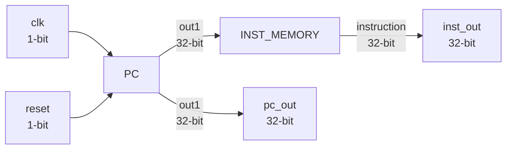
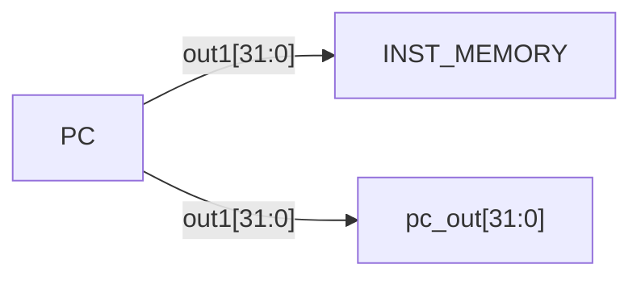
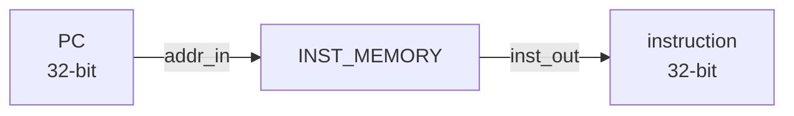
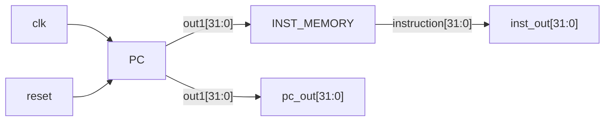

# Instruction Fetch Unit (IF Unit)

The Instruction Fetch Unit (IF Unit) is responsible for generating the current Program Counter (PC) value and fetching the corresponding instruction from Instruction Memory.

The unit integrates the `PC` and `INST_MEMORY` modules into a single instruction-fetch stage.

The `PC` generates the current instruction address, which is provided to the Instruction Memory. The Instruction Memory then returns the corresponding 32-bit instruction.

## Block Diagram



## Module Interface

```verilog
module IF_UNIT(
    input wire clk,
    input wire reset,
    output wire [31:0] pc_out,
    output wire [31:0] inst_out
);
```

## Interface

| Signal | Width | Direction | Description |
|---|---:|---|---|
| `clk` | 1 bit | Input | Clock signal supplied to the Program Counter |
| `reset` | 1 bit | Input | Reset signal supplied to the Program Counter |
| `pc_out` | 32 bits | Output | Current Program Counter value |
| `inst_out` | 32 bits | Output | 32-bit instruction fetched from Instruction Memory |

## Internal Architecture

The Instruction Fetch Unit is composed of two existing processor components:

- `PC`
- `INST_MEMORY`

The `IF_UNIT` connects these components together to create the instruction-fetch path.

### Program Counter

The `PC` module receives:

```text
clk
reset
```

and produces a 32-bit PC value:

```text
out1[31:0]
```

The PC output is used in two places inside the IF Unit:

1. It is connected to the address input of `INST_MEMORY`.
2. It is assigned to the external `pc_out` output.

The corresponding RTL connection is:

```verilog
PC inst1 (
    .clk(clk), 
    .reset(reset),
    .pc_out(out1)
);
```

## Instruction Memory

The `INST_MEMORY` module receives the current PC value through its address input.

```verilog
INST_MEMORY inst2 (
    .addr_in(out1),
    .inst_out(instruction)
);
```

The Instruction Memory returns the corresponding 32-bit instruction through:

```text
instruction[31:0]
```

This value is then assigned to the external `inst_out` output.

## Internal Signals

The IF Unit uses two internal 32-bit wires:

| Signal | Width | Description |
|---|---:|---|
| `out1` | 32 bits | PC value generated by the `PC` module |
| `instruction` | 32 bits | Instruction returned by `INST_MEMORY` |

These signals connect the internal modules together.

## Data Flow

The instruction-fetch operation follows this sequence:

```text
clk / reset
     ↓
    PC
     ↓
   out1
     ↓
INST_MEMORY
     ↓
instruction
     ↓
  inst_out
```

At the same time, the PC value is directly forwarded to `pc_out`:

```text
PC → out1 → pc_out
```

## PC Connection

The current PC value generated by the `PC` module is connected to the Instruction Memory address input:

```text
out1 → addr_in
```

This allows the Instruction Memory to select the instruction corresponding to the current program counter.

The PC value is also exposed through:

```text
pc_out
```

The relationship can be represented as:



## Instruction Memory Connection

The Instruction Memory receives the PC value and produces the fetched instruction.



The internal `instruction` signal is then connected to the external `inst_out` output.

```verilog
assign inst_out = instruction;
```

## Output Assignments

The IF Unit exposes the internal PC and instruction signals through continuous assignments:

```verilog
assign pc_out = out1;
assign inst_out = instruction;
```

Therefore:

```text
pc_out   = out1
inst_out = instruction
```

No additional processing is performed on either output.

## Complete Data Flow

The complete internal operation can be represented as:



The `PC` determines the current instruction address, while `INST_MEMORY` provides the instruction stored at that address.

## Role in the Processor

The Instruction Fetch Unit forms the front end of the RV32I processor.

Its primary responsibilities are:

1. Generate the current PC value through the `PC` module.
2. Provide the PC value to Instruction Memory.
3. Fetch the corresponding 32-bit instruction.
4. Output the current PC through `pc_out`.
5. Output the fetched instruction through `inst_out`.

The resulting outputs can be supplied to subsequent processor stages such as the Decoder.

```text
IF_UNIT
   │
   ├── pc_out
   │
   └── inst_out
          ↓
       DECODER
```

## Design Characteristics

| Parameter | Value |
|---|---|
| Architecture | RISC-V RV32I |
| PC Width | 32 bits |
| Instruction Width | 32 bits |
| Clock | 1 bit |
| Reset | 1 bit |
| PC Output | 32 bits |
| Instruction Output | 32 bits |
| Internal Modules | `PC`, `INST_MEMORY` |
| HDL | Verilog |

## Module Files

```text
IF_UNIT/
├── IF_UNIT.v
├── IF_UNIT_tb.v
└── README.md
```

- `IF_UNIT.v` — synthesizable Instruction Fetch Unit RTL.
- `IF_UNIT_tb.v` — simulation testbench for verifying the Instruction Fetch Unit.
- `README.md` — technical documentation for the Instruction Fetch Unit.

## Summary

The Instruction Fetch Unit integrates the Program Counter and Instruction Memory into a single processor block.

The internal operation is:

```text
PC
 ↓
out1
 ↓
INST_MEMORY
 ↓
instruction
 ↓
inst_out
```

while the current PC is simultaneously provided through:

```text
out1 → pc_out
```

This creates the basic instruction-fetch path required by the RV32I processor.
