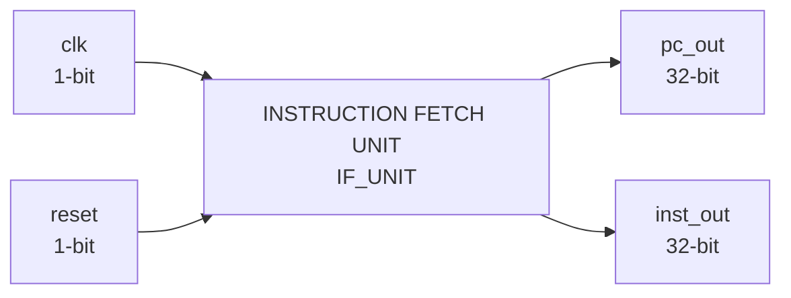
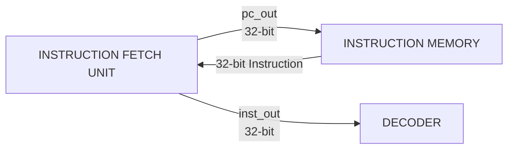

# Instruction Fetch Unit (IF Unit)

The Instruction Fetch Unit (IF Unit) is the front-end component of the RV32I processor responsible for fetching instructions from instruction memory.

It maintains the current Program Counter (PC) value and uses it to obtain the corresponding 32-bit instruction from instruction memory.

The IF Unit is controlled by the processor clock and reset signals and provides both the current PC value and the fetched instruction as outputs.

## Block Diagram



## Module Interface

```verilog
module IF_UNIT(
    input  wire        clk,
    input  wire        reset,
    output wire [31:0] pc_out,
    output wire [31:0] inst_out
);
```

## Interface

| Signal | Width | Direction | Description |
|---|---:|---|---|
| `clk` | 1 bit | Input | Processor clock signal |
| `reset` | 1 bit | Input | Reset signal for the instruction fetch logic |
| `pc_out` | 32 bits | Output | Current Program Counter value |
| `inst_out` | 32 bits | Output | 32-bit instruction fetched from instruction memory |

## Function

The Instruction Fetch Unit performs the initial stage of instruction execution.

Its primary responsibilities are:

1. Maintain the current Program Counter value.
2. Use the PC value as the instruction address.
3. Fetch the corresponding instruction from instruction memory.
4. Provide the current PC and fetched instruction to the next stage of the processor.

The basic instruction-fetch operation is:

```text
PC → Instruction Memory → Instruction
```

## Program Counter

The Program Counter maintains the address of the current instruction.

The PC is a 32-bit value and is provided through the `pc_out` output.

```text
pc_out[31:0]
```

The Program Counter is controlled by the `clk` and `reset` signals.

The exact PC update and reset behavior is defined by the RTL implementation.

## Instruction Fetch

The current PC value is used to access instruction memory.

Instruction memory provides the corresponding 32-bit instruction, which is then available through `inst_out`.

```text
pc_out → Instruction Memory → inst_out
```

The fetched instruction is passed to the instruction decoding stage of the processor.

## Instruction Output

The `inst_out` signal is 32 bits wide:

```text
inst_out[31:0]
```

It contains the complete instruction fetched from instruction memory.

The instruction can contain fields such as:

- `opcode`
- `rd`
- `funct3`
- `rs1`
- `rs2`
- `funct7`
- Immediate fields

These fields are interpreted by the Decoder in the next stage of the processor.

## Clock and Reset

### Clock

The `clk` input provides the timing reference for the sequential portions of the instruction-fetch logic.

The Program Counter updates according to the clock-driven behavior defined in the RTL.

### Reset

The `reset` input initializes the instruction-fetch state according to the reset logic implemented in the RTL.

The exact reset value of the Program Counter is determined by the implementation.

## Processor Connection

The Instruction Fetch Unit forms the interface between the Program Counter, Instruction Memory, and Decoder.



The PC provides the address required to fetch the instruction, while the fetched instruction is passed to the Decoder for further processing.

## Instruction Fetch Flow

The instruction-fetch process can be summarized as:

```text
1. Program Counter provides the current instruction address.
2. Instruction Memory receives the address.
3. Instruction Memory provides the corresponding 32-bit instruction.
4. The IF Unit outputs the instruction through inst_out.
5. The instruction is passed to the Decoder.
```

Conceptually:

```text
Program Counter
      ↓
Instruction Address
      ↓
Instruction Memory
      ↓
32-bit Instruction
      ↓
Instruction Decoder
```

## Design Characteristics

| Parameter | Value |
|---|---|
| Architecture | RISC-V RV32I |
| PC Width | 32 bits |
| Instruction Width | 32 bits |
| Clock | 1 bit |
| Reset | 1 bit |
| PC Output | 32 bits |
| Instruction Output | 32 bits |
| Logic Type | Sequential + Combinational |
| HDL | Verilog |

## Module Files

```text
IF_UNIT/
├── IF_UNIT.v
├── IF_UNIT_tb.v
└── README.md
```

- `IF_UNIT.v` — synthesizable Instruction Fetch Unit RTL.
- `IF_UNIT_tb.v` — simulation testbench for verifying instruction-fetch behavior.
- `README.md` — technical documentation for the Instruction Fetch Unit.

## Role in the RV32I Processor

The Instruction Fetch Unit is the first functional stage of the processor datapath.

It provides:

```text
pc_out   → Current Program Counter
inst_out → Current Instruction
```

These outputs are used by subsequent processor components, particularly the Decoder.

The overall processor flow begins with:

```text
Instruction Fetch
        ↓
Instruction Decode
        ↓
Register / Immediate Generation
        ↓
Execution
        ↓
Memory Access
        ↓
Write Back
```

The Instruction Fetch Unit therefore provides the processor with the instruction required for each execution step.
