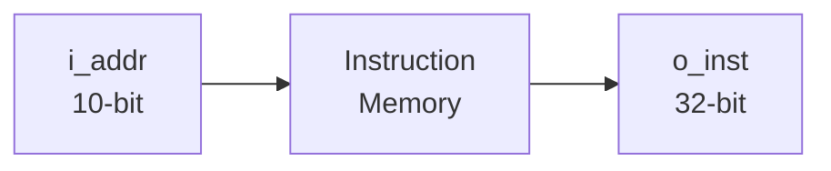

# Instruction Memory

Instruction Memory is the component responsible for storing and providing instructions to the RV32I processor.

It receives a 10-bit address and returns the corresponding 32-bit instruction.

## Block Diagram



## Interface

| Signal   |   Width | Direction | Description                                |
| -------- | ------: | --------- | ------------------------------------------ |
| `i_addr` | 10 bits | Input     | Address used to select an instruction      |
| `o_inst` | 32 bits | Output    | Instruction stored at the selected address |

## Address Input

The `i_addr` input is 10 bits wide.

A 10-bit address can represent:

```text
2^10 = 1024
```

different address values.

The address is used to select the instruction location within the instruction memory.

## Instruction Output

The `o_inst` output is 32 bits wide:

```text
o_inst[31:0]
```

The output represents the instruction stored at the address provided through `i_addr`.

The 32-bit instruction follows the standard instruction width of the RV32I base integer instruction set.

## Instruction Fetch

During instruction fetch, the processor supplies an address to the Instruction Memory. The corresponding instruction is then provided to the next stage of the processor.

The basic operation is:

```text
i_addr → Instruction Memory → o_inst
```

## Memory Organization

The Instruction Memory provides up to 1024 addressable locations based on the 10-bit address input.

Each location provides a 32-bit instruction.

Therefore, the logical organization is:

```text
Number of address locations = 1024
Instruction width            = 32 bits
Address width                = 10 bits
```

## RV32I Instruction

The 32-bit instruction returned by `o_inst` contains the fields required by the processor for instruction decoding.

Depending on the instruction format, these fields can include:

* Opcode
* Destination register (`rd`)
* Source register (`rs1`)
* Source register (`rs2`)
* `funct3`
* `funct7`
* Immediate fields

The instruction is subsequently interpreted by the Decoder.

## Design Characteristics

| Parameter             | Value                      |
| --------------------- | -------------------------- |
| Instruction Set       | RISC-V RV32I               |
| Instruction Width     | 32 bits                    |
| Address Width         | 10 bits                    |
| Addressable Locations | 1024                       |
| Output Width          | 32 bits                    |
| Logic                 | Instruction Storage / Read |
| HDL                   | Verilog                    |

## Module Files

```text
INST_MEMORY/
├── INST_MEMORY.v
├── INST_MEMORY_tb.v
└── README.md
```

`INST_MEMORY.v` contains the Instruction Memory RTL implementation, while `INST_MEMORY_tb.v` is used to verify instruction retrieval during simulation.

## Role in the Processor

Instruction Memory provides the processor with the instruction corresponding to the current instruction address.

Its fundamental operation is:

```text
Address → Instruction
```

The fetched 32-bit instruction is then passed to the instruction decoding logic.
