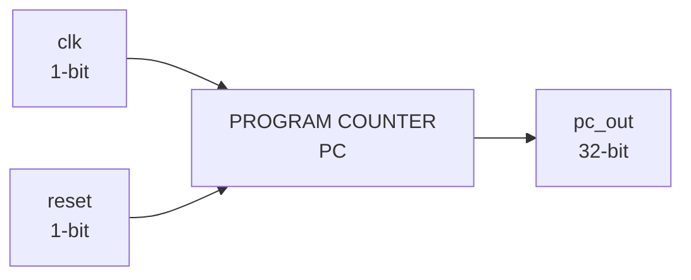

# Program Counter (PC)

The Program Counter (PC) is a sequential component of the RV32I processor that stores the address of the current instruction being executed or fetched.

The PC is controlled by a clock and reset signal and provides the current program-counter value through a 32-bit output.

## Block Diagram



## Module Interface

```verilog
module PC(
    input wire clk,
    input wire reset,
    output reg [31:0] pc_out
);
```

## Interface

| Signal   |   Width | Direction | Description                           |
| -------- | ------: | --------- | ------------------------------------- |
| `clk`    |   1 bit | Input     | Clock signal used to update the PC    |
| `reset`  |   1 bit | Input     | Reset control for the Program Counter |
| `pc_out` | 32 bits | Output    | Current Program Counter value         |

## Clock

The `clk` input provides the timing reference for the Program Counter.

The PC is a sequential element, meaning its stored value changes according to the clock-driven behavior defined in the RTL.

```text
clk → PC state update
```

## Reset

The `reset` input controls the reset behavior of the Program Counter.

When reset is asserted, the PC responds according to the reset logic implemented in `PC.v`.

The exact reset value and reset behavior are determined by the RTL implementation.

## Program Counter Value

The output:

```text
pc_out[31:0]
```

represents the current 32-bit Program Counter value.

A 32-bit PC is used because the processor operates with 32-bit addresses and data in the RV32I architecture.

## Role in Instruction Fetch

The Program Counter provides the address used to access the next instruction from Instruction Memory.

The basic relationship is:

```text
PC → Instruction Memory → Instruction
```

The current value of `pc_out` can therefore be used as the instruction address supplied to the instruction-fetch path.

## Connection with Instruction Memory

The PC and Instruction Memory form the basic instruction-fetch path of the processor.


The PC provides the address, while Instruction Memory provides the instruction stored at that address.

## Sequential Nature

Unlike purely combinational components such as the ALU and Immediate Generator, the Program Counter is a sequential component because it stores state.

Its behavior depends on:

* Current PC value
* Clock signal
* Reset signal
* The next-PC logic defined by the processor

The PC therefore acts as the state-holding element for the instruction address.

## Design Characteristics

| Parameter    | Value        |
| ------------ | ------------ |
| Architecture | RISC-V RV32I |
| PC width     | 32 bits      |
| Clock input  | 1 bit        |
| Reset input  | 1 bit        |
| Output width | 32 bits      |
| Logic type   | Sequential   |
| HDL          | Verilog      |

## Module Files

```text
PC/
├── PC.v
├── PC_tb.v
└── README.md
```

* `PC.v` — synthesizable Program Counter RTL.
* `PC_tb.v` — simulation testbench for verifying Program Counter behavior.
* `README.md` — technical documentation for the Program Counter.

## Role in the RV32I Processor

The Program Counter maintains the address associated with instruction execution and provides the address required by the instruction-fetch path.

Its primary interface is:

```text
clk + reset → PC → pc_out
```

The `pc_out` value is subsequently used by the instruction-fetch logic to obtain the corresponding instruction.
