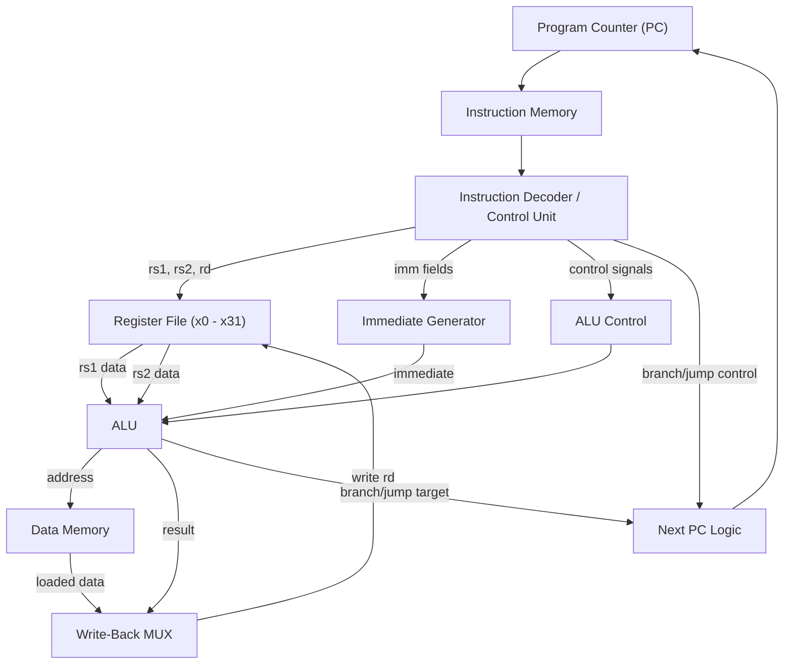
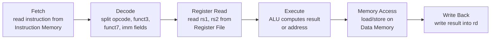

# RV32I-Processor-Verilog

**A 32-bit RISC-V RV32I processor core, implemented from scratch in Verilog HDL and built for Xilinx Vivado.**


---

## Overview

**RV32I** is the base 32-bit integer instruction set of the RISC-V architecture. It defines the minimal set of instructions, registers, and rules a processor needs to run real software — integer arithmetic, logic operations, memory access, and control flow — without any optional extensions.

This repository implements a **32-bit processor core in Verilog HDL** that understands and executes instructions from the RV32I base ISA. The design is built around the standard RISC-V datapath model: an instruction flows through fetch, decode, register read, execute, memory access, and write-back stages, using dedicated hardware blocks for each step.

The project is developed and simulated using **Xilinx Vivado**, targeting FPGA-based implementation and verification.

---

## What is RISC-V?

**RISC-V** is a free and open Instruction Set Architecture (ISA) — a standard that defines how software talks to hardware at the instruction level. Unlike proprietary ISAs (such as x86 or ARM), RISC-V is open, royalty-free, and modular, which means anyone can design, build, and even manufacture RISC-V-compatible processors without licensing fees.

RISC-V is organized as a **small mandatory base ISA plus optional extensions**:

| Component | Description |
|---|---|
| **RV32I** | Base integer ISA — 32-bit registers, integer arithmetic, load/store, branches |
| **M** | Integer multiplication and division |
| **F / D** | Single- and double-precision floating point |
| **C** | Compressed (16-bit) instructions for code density |

**RV32I is important because it is the foundation everything else builds on.** Any processor that implements RV32I correctly can run standard RISC-V software, and every extension is layered on top of it without changing its behavior. This makes RV32I the natural starting point for learning processor design and for building a working CPU from the ground up — which is exactly what this project does.

---

## Processor Architecture

At a high level, the processor is organized around a single **datapath** that moves an instruction through a sequence of well-defined stages, with a **control unit** deciding how each stage behaves based on the instruction being executed.

The general flow is:

1. The **Program Counter (PC)** supplies the address of the next instruction.
2. The **Instruction Memory** returns the 32-bit instruction stored at that address.
3. The **Decoder / Control Unit** interprets the instruction and generates control signals.
4. The **Register File** supplies the source operand values.
5. The **Immediate Generator** extracts and sign-extends any embedded constant.
6. The **ALU** performs the required arithmetic/logic operation or address calculation.
7. The **Data Memory** is accessed only for load/store instructions.
8. The **Write-Back logic** returns the final result to the destination register.

Every RV32I instruction moves through this same structure — what changes from instruction to instruction is *which* control signals are active and *which* data paths are used, not the overall skeleton.

---

## Main Components

### Program Counter (PC)
A 32-bit register holding the address of the instruction currently being fetched. After each instruction, it is normally updated to `PC + 4` (the next sequential instruction), unless a branch or jump redirects it to a new target address.

### Instruction Memory
A read-only memory block that stores the compiled program. Given the address from the PC, it returns the 32-bit instruction word to be decoded and executed.

### Instruction Fetch Unit
The logic responsible for retrieving the instruction from Instruction Memory using the current PC value, and for computing the next PC (sequential `+4`, or a branch/jump target).

### Instruction Decoder / Control Unit
Breaks the 32-bit instruction into its constituent fields — **opcode, rd, funct3, rs1, rs2, funct7**, and immediate bits — and generates the control signals that steer every other block: which ALU operation to perform, whether to read/write memory, whether to write back to the register file, and where the next PC comes from.

### Register File
An array of **32 general-purpose registers (x0–x31)**, each 32 bits wide. It supports reading two source registers (`rs1`, `rs2`) and writing one destination register (`rd`) per instruction.

> **Note:** `x0` is hardwired to the constant value `0`. Writes to `x0` are discarded, and reads always return `0`. This is used by RV32I to synthesize useful pseudo-behaviors (such as unconditional jumps or "no-op" moves) without needing extra instructions.

### Immediate Generator
RV32I instructions embed constants (immediates) in different bit positions depending on the instruction format. The Immediate Generator extracts the relevant bits, reassembles them in the correct order, and sign-extends the result to 32 bits, producing a single consistent immediate value regardless of the original instruction format.

### ALU (Arithmetic Logic Unit)
The computational core of the datapath. It performs addition, subtraction, logical operations, shifts, and comparisons. The same ALU hardware is reused across many different instructions by simply changing its control input and one of its operands (register value vs. immediate).

### Data Memory
A read/write memory block accessed only by load and store instructions. Loads bring a value from memory into a register; stores write a register value out to memory. Arithmetic and logic instructions never touch this block directly.

### Write-Back Logic
Selects which value should be written back into the destination register `rd` — the ALU result, a value loaded from Data Memory, or `PC + 4` (used by jump-and-link instructions) — and drives it into the Register File.

---

## Instruction Execution Flow

Every RV32I instruction conceptually passes through the same six steps:

| Stage | What Happens |
|---|---|
| **1. Fetch** | Read the instruction word from Instruction Memory at the address in the PC. |
| **2. Decode** | Split the instruction into opcode, funct3, funct7, rs1, rs2, rd, and immediate fields. |
| **3. Register Read** | Read the values of source registers `rs1` and `rs2` from the Register File. |
| **4. Execute** | The ALU computes a result — an arithmetic/logic value, a branch condition, or a memory address. |
| **5. Memory Access** | For loads/stores only: read from or write to Data Memory at the ALU-computed address. |
| **6. Write Back** | Write the final result (ALU output, loaded data, or `PC + 4`) into register `rd`, if the instruction requires it. |

Not every instruction uses every stage — for example, an `ADD` never touches Data Memory, and a branch never writes back to a register — but the control signals generated at decode time ensure only the relevant stages are active for each instruction.

---

## RV32I Instruction Formats

RV32I keeps every instruction a fixed 32 bits wide, encoded in one of **six formats**. Each format arranges the same basic fields — opcode, register selectors, funct codes, and immediate bits — in a fixed bit layout so the decoder logic stays simple and uniform.

```
R-type  | funct7[31:25] | rs2[24:20] | rs1[19:15] | funct3[14:12] | rd[11:7]        | opcode[6:0] |
I-type  | imm[31:20]                 | rs1[19:15] | funct3[14:12] | rd[11:7]        | opcode[6:0] |
S-type  | imm[31:25]     | rs2[24:20]| rs1[19:15] | funct3[14:12] | imm[11:7]       | opcode[6:0] |
B-type  | imm[31]imm[30:25] | rs2[24:20] | rs1[19:15] | funct3[14:12] | imm[11:8]imm[7] | opcode[6:0] |
U-type  | imm[31:12]                                              | rd[11:7]        | opcode[6:0] |
J-type  | imm[31]imm[30:21]imm[20]imm[19:12]                      | rd[11:7]        | opcode[6:0] |
```

| Format | Used By | Purpose |
|---|---|---|
| **R** | `ADD`, `SUB`, `AND`, `OR`, `SLL`, `SLT`, ... | Register-register arithmetic/logic |
| **I** | `ADDI`, `LW`, `JALR`, ... | Register-immediate arithmetic, loads, jumps |
| **S** | `SW`, `SH`, `SB` | Store to memory |
| **B** | `BEQ`, `BNE`, `BLT`, ... | Conditional branches |
| **U** | `LUI`, `AUIPC` | Load a 20-bit immediate into the upper bits |
| **J** | `JAL` | Unconditional jump with a large offset |

Splitting the immediate across non-contiguous bit positions (as in S, B, and J types) is intentional — it keeps `rs1`, `rs2`, and `opcode` in the same bit positions across formats, which simplifies the decoder.

---

## RV32I Instruction Categories

The RV32I base ISA is deliberately small. Its instructions fall into a handful of categories:

**R-type — Register arithmetic/logic**
`ADD`, `SUB`, `AND`, `OR`, `XOR`, `SLL`, `SRL`, `SRA`, `SLT`, `SLTU`

**I-type — Immediate arithmetic/logic**
`ADDI`, `ANDI`, `ORI`, `XORI`, `SLLI`, `SRLI`, `SRAI`, `SLTI`, `SLTIU`

**Load instructions (I-type)**
`LB`, `LH`, `LW`, `LBU`, `LHU`

**Store instructions (S-type)**
`SB`, `SH`, `SW`

**Branch instructions (B-type)**
`BEQ`, `BNE`, `BLT`, `BGE`, `BLTU`, `BGEU`

**Upper-immediate instructions (U-type)**
`LUI` — load a value into the upper 20 bits of a register
`AUIPC` — add a 20-bit immediate to the PC, used for PC-relative addressing

**Jump instructions**
`JAL` (J-type) — jump and link, target computed relative to PC
`JALR` (I-type) — jump and link register, target computed from a register plus offset

---

## How the Decoder Reads an Instruction

The decoder's job is to turn a flat 32-bit word into meaningful control information:

- **`opcode` (bits 6:0)** — identifies the instruction *format* and its broad category (R-type, load, store, branch, etc.). This is the first thing decoded.
- **`funct3` (bits 14:12)** — within a given opcode, selects the specific operation (e.g., distinguishing `ADD`/`ADDI` from `AND`/`ANDI`, or `BEQ` from `BLT`).
- **`funct7` (bits 31:25)** — used only in R-type instructions to disambiguate operations that share the same opcode and funct3 (e.g., `ADD` vs. `SUB`, or `SRL` vs. `SRA`).
- **`rs1`, `rs2` (bits 19:15, 24:20)** — select which registers supply the source operands.
- **`rd` (bits 11:7)** — selects which register receives the result.

Together, `opcode + funct3 + funct7` fully determine which operation the ALU should perform, while `rs1`, `rs2`, and `rd` determine which registers are involved.

---

## The ALU and Instruction Reuse

RV32I is designed so that a **single ALU** can serve nearly the entire instruction set. The ALU doesn't know or care whether it's executing `ADD` or `ADDI` — it simply receives two 32-bit operands and a control code telling it what operation to perform.

The reuse works through two simple choices made earlier in the datapath:

1. **Operand B selection** — a multiplexer chooses between a second register value (`rs2`, for R-type) or the sign-extended immediate (for I-type). Everything downstream of that mux is identical.
2. **ALU control code** — derived from `opcode`/`funct3`/`funct7`, this tells the ALU which operation to run (add, subtract, shift, compare, etc.).

This is why `ADD` and `ADDI` share the same underlying adder, `SLL` and `SLLI` share the same shifter, and so on — only the source of the second operand and the control code change. The same ALU is also reused to compute **memory addresses** for loads/stores (`base register + offset`) and **branch conditions** (by subtracting or comparing two registers).

---

## Load-Store Architecture

RV32I follows a classic **load-store architecture**: arithmetic and logic instructions operate *only* on registers, never directly on memory. Memory is touched exclusively through dedicated `LOAD` and `STORE` instructions.

- A **load** (`LW`, `LB`, `LH`, `LBU`, `LHU`) computes an address as `rs1 + immediate`, reads a value from Data Memory at that address, and writes it into `rd`.
- A **store** (`SW`, `SB`, `SH`) computes an address the same way, then writes the value in `rs2` to Data Memory at that address.

Because memory is only ever touched by these two instruction types, the Data Memory interface stays simple: one address input (from the ALU), one write-data input (from the register file), and one read-data output (toward write-back).

---

## Verification / Simulation

Each Verilog module in this design is intended to be verified independently using a dedicated **testbench** before being integrated into the full datapath. In **Xilinx Vivado**, this is done by:

- Writing a testbench that applies stimulus (instructions, register values, memory contents) to the module under test.
- Running **behavioral simulation** to observe internal signals and outputs over time.
- Inspecting the resulting **waveform** in the Vivado simulator to confirm that control signals, ALU outputs, memory accesses, and register writes behave as expected for a given instruction.

This module-by-module simulation approach allows each datapath component — PC, decoder, register file, ALU, memory interfaces — to be validated on its own before being connected into the complete processor.

---

## Tools and Technologies

| Tool / Technology | Role in this Project |
|---|---|
| **Verilog HDL** | Hardware description language used to implement all processor modules |
| **Xilinx Vivado** | Design, simulation, and FPGA implementation environment |
| **RISC-V RV32I ISA** | The instruction set architecture this processor implements |
| **Git / GitHub** | Version control and project hosting |

---

## Architecture at a Glance



---

## Instruction Flow at a Glance



---

## Repository Scope

This repository focuses purely on the **hardware design of the RV32I processor core** — its datapath, control logic, and instruction handling — implemented in Verilog and targeted at Xilinx Vivado for simulation and FPGA implementation.
