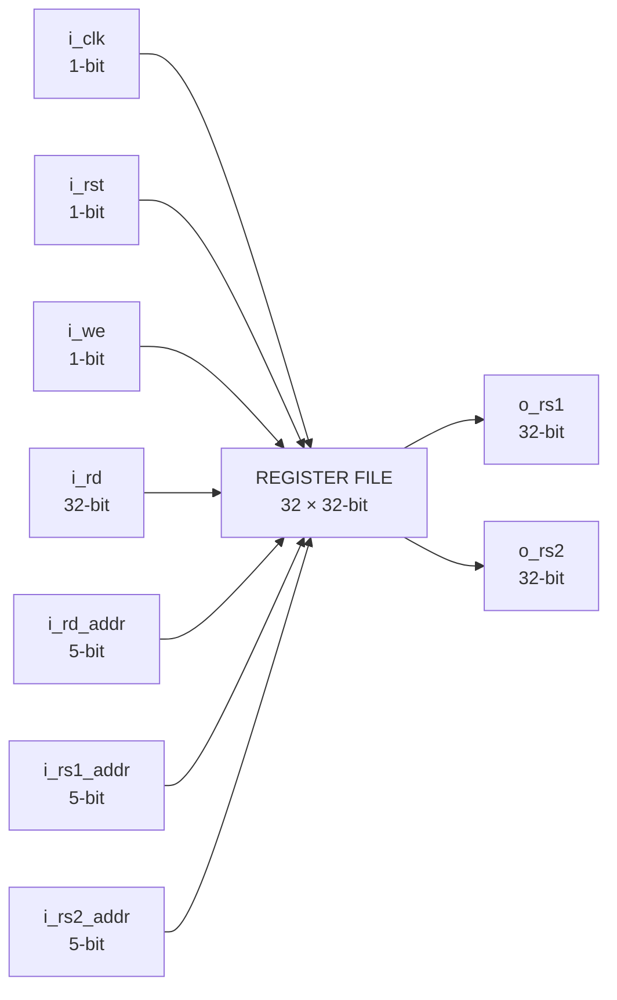
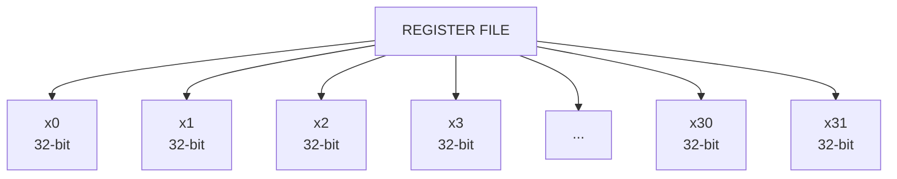
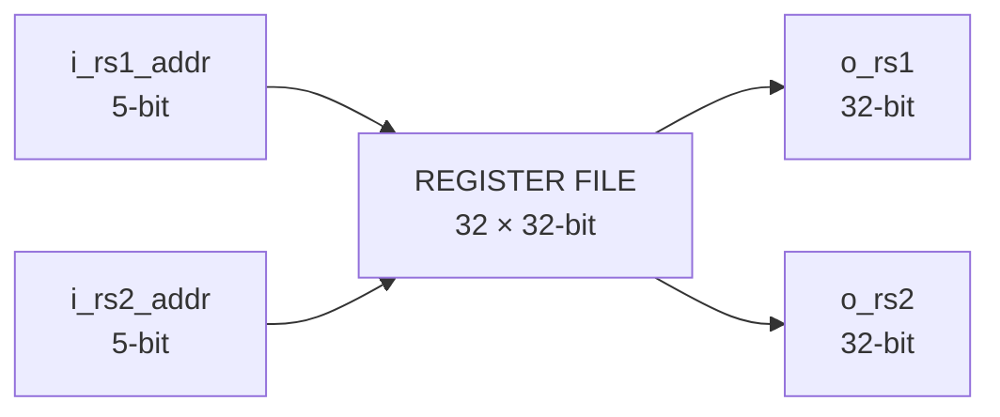
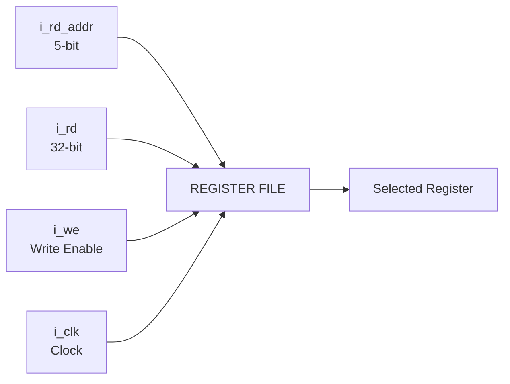
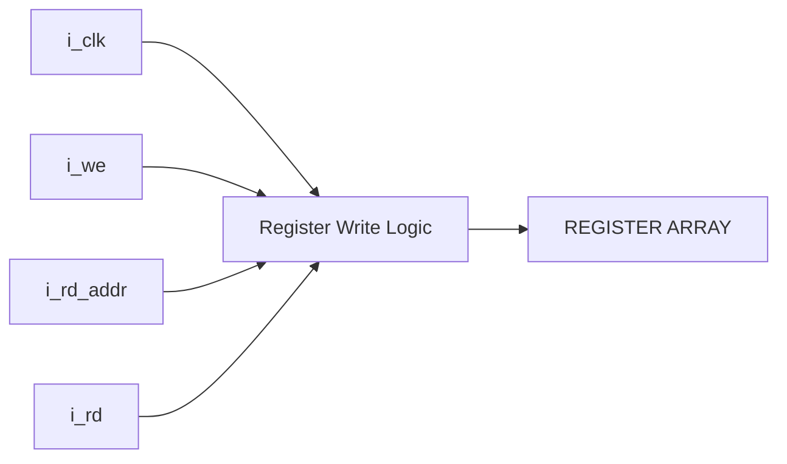
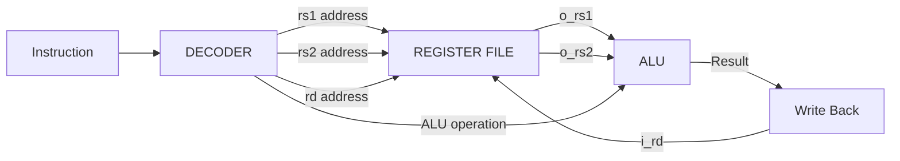
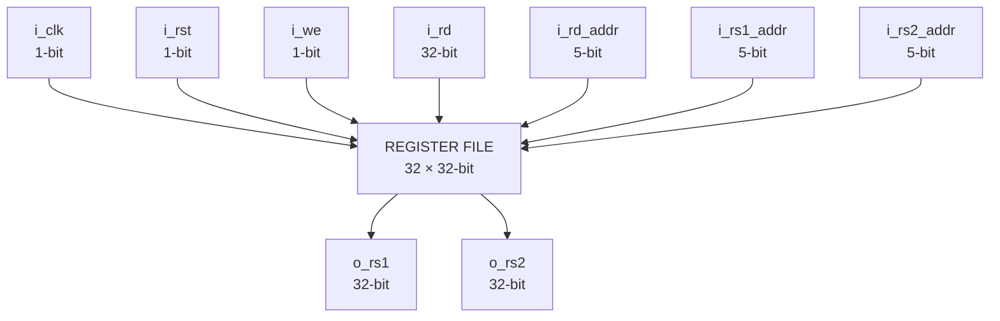
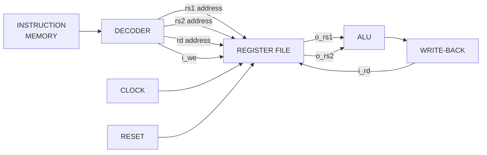

# Register File

The Register File is the general-purpose register storage unit of the RV32I processor. It contains 32 registers, each 32 bits wide, and provides two independent read ports and one write port.

The Register File is controlled by a clock, reset, and write-enable signal. Two register addresses can be supplied simultaneously to obtain two register values, while a separate destination address selects the register to be written.

## Block Diagram



## Interface

| Signal       |   Width | Direction | Description                                   |
| ------------ | ------: | --------- | --------------------------------------------- |
| `i_clk`      |   1 bit | Input     | Clock signal                                  |
| `i_rst`      |   1 bit | Input     | Reset signal                                  |
| `i_we`       |   1 bit | Input     | Register write enable                         |
| `i_rd`       | 32 bits | Input     | Data to be written into the selected register |
| `i_rd_addr`  |  5 bits | Input     | Address of the destination register           |
| `i_rs1_addr` |  5 bits | Input     | Address of the first source register          |
| `i_rs2_addr` |  5 bits | Input     | Address of the second source register         |
| `o_rs1`      | 32 bits | Output    | Data read from the first source register      |
| `o_rs2`      | 32 bits | Output    | Data read from the second source register     |

## Register Organization

The Register File contains 32 general-purpose registers:

```text
x0, x1, x2, x3, ... , x30, x31
```

Each register stores a 32-bit value.



A 5-bit address is sufficient to select any one of the 32 registers:

```text
2^5 = 32
```

Therefore:

```text
i_rd_addr  → destination register
i_rs1_addr → first source register
i_rs2_addr → second source register
```

## Read Ports

The Register File provides two independent read ports.

The first read address selects the register whose value appears on `o_rs1`.

The second read address selects the register whose value appears on `o_rs2`.



Conceptually:

```text
o_rs1 = Register[i_rs1_addr]

o_rs2 = Register[i_rs2_addr]
```

This dual-read structure allows an instruction to obtain two source operands simultaneously.

## Write Port

The Register File has one write port.

The destination register is selected using `i_rd_addr`, while `i_rd` contains the 32-bit value to be written.

The write operation is controlled by `i_we`.



Conceptually, when the write enable is asserted:

```text
Register[i_rd_addr] ← i_rd
```

The write operation is synchronized with the clock.

## Clock and Write Operation

The clock provides the timing reference for register updates.



The register selected by `i_rd_addr` is updated with `i_rd` when the write operation is enabled.

This separates the **write operation** from the register read paths.

## Reset

The Register File includes an active reset input:

```text
i_rst
```

The reset initializes the register storage according to the RTL implementation.


The exact reset behavior is defined by `REG_FILE.v`.

## RISC-V Register x0

In the RV32I architecture, register `x0` is hardwired to zero.

```text
x0 = 0
```

Therefore, reading register address `00000` produces:

```text
o_rs1 = 32'b0
```

or:

```text
o_rs2 = 32'b0
```

depending on which read port selects `x0`.

A write operation targeting `x0` must not change its value.


## Register File and ALU

The two read ports allow the Register File to provide the operands required by register-register instructions.


For an R-type instruction such as:

```text
ADD rd, rs1, rs2
```

the datapath can be represented as:



The Register File therefore provides the source operands and stores the result produced by the execution unit.

## Register File Datapath

The complete Register File interface can be represented as:



## Data Width

The Register File uses a 32-bit data width throughout the register storage and data paths.

```text
Number of registers = 32
Register width       = 32 bits
Address width        = 5 bits
Read ports           = 2
Write ports          = 1
```

The total logical register storage is:

```text
32 × 32 = 1024 bits
```

## Role in the RV32I Processor

The Register File is positioned between instruction decoding and execution.



The Register File provides the processor with its general-purpose integer registers and forms the primary interface between instruction decoding, operand execution, and result write-back.

## Module Files

```text
REG_FILE/
├── REG_FILE.v
├── REG_FILE_tb.v
└── README.md
```

* `REG_FILE.v` — synthesizable Register File RTL.
* `REG_FILE_tb.v` — simulation testbench for verifying Register File behavior.
* `README.md` — architectural and interface documentation.
