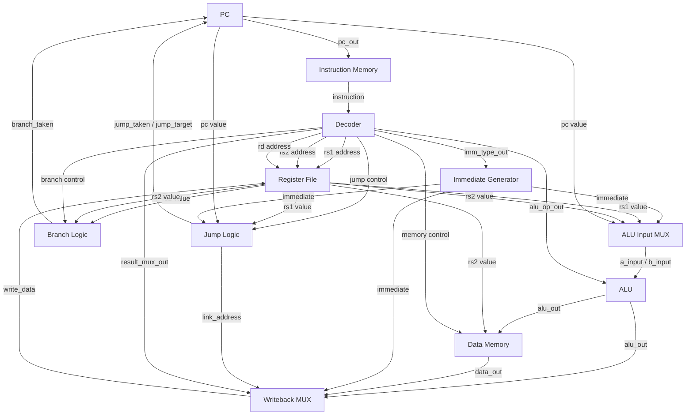

# Top-Level CPU

The **Top-Level CPU** module connects all the individual components of the RV32I single-cycle processor into one complete datapath.

It is responsible for providing the connections between the Program Counter, Instruction Memory, Decoder, Register File, Immediate Generator, ALU Input MUX, ALU, Branch Logic, Jump Logic, Data Memory, and Writeback MUX.

The Top-Level CPU does not perform a new operation itself. Its main purpose is to **integrate the individual modules so that a complete instruction can be fetched, decoded, executed, and completed in a single clock cycle**.

## Processor Architecture

The overall processor follows this datapath:



## Main Components

The Top-Level CPU integrates the following modules:

| Module | Purpose |
|---|---|
| `PC` | Stores and updates the current program counter |
| `INST_MEMORY` | Stores and provides instructions |
| `IF_UNIT` | Handles instruction fetch and PC connection |
| `DECODER` | Decodes the instruction and generates control signals |
| `REG_FILE` | Provides register values and receives writeback data |
| `IMME_GEN` | Generates the immediate value according to instruction type |
| `ALU_INPUT_MUX` | Selects the two inputs of the ALU |
| `ALU` | Performs arithmetic, logical, comparison, and shift operations |
| `BRANCH_LOGIC` | Determines whether a conditional branch is taken |
| `JUMP_LOGIC` | Calculates JAL/JALR target and link address |
| `DATA_MEMORY` | Performs load and store operations |
| `WRITEBACK_MUX` | Selects the value written back to the destination register |

## Instruction Flow

A complete instruction passes through the processor as follows:

```text
Instruction Fetch
        ↓
Instruction Decode
        ↓
Register Read
        ↓
Immediate Generation
        ↓
ALU Input Selection
        ↓
ALU / Branch / Jump / Memory
        ↓
Writeback
        ↓
Register File
```

Because this is a **single-cycle processor**, the complete datapath for an instruction is executed within one processor cycle.

## Instruction Fetch

The `PC` provides the current instruction address:

```text
PC → Instruction Memory
```

The `INST_MEMORY` returns the instruction located at that address.

The `IF_UNIT` connects the Program Counter with the Instruction Memory and provides:

```text
pc_out
inst_out
```

to the rest of the processor.

## Instruction Decode

The `DECODER` receives the 32-bit instruction and generates the required control signals.

It identifies the instruction using:

```text
opcode
funct3
funct7
```

when required.

The Decoder also generates the register addresses:

```text
rs1_addr_out
rs2_addr_out
rd_addr_out
```

and the immediate type:

```text
imm_type_out
```

## Register File

The `REG_FILE` provides the actual values of the source registers:

```text
rs1 value
rs2 value
```

The selected writeback value is also written back into the destination register:

```text
write_data → rd
```

The Register File ensures that:

```text
x0 = 0
```

and prevents writes to register `x0`.

## Immediate Generation

The `IMME_GEN` uses `imm_type_out` from the Decoder to generate the appropriate immediate.

The supported immediate types are:

| `imm_type_out` | Type |
|---|---|
| `000` | I-Type |
| `001` | S-Type |
| `010` | B-Type |
| `011` | U-Type |
| `100` | J-Type |
| `101` | R-Type / no immediate |

The generated immediate is used by the ALU, Data Memory, and control-flow path as required.

## ALU Input Selection

The `ALU_INPUT_MUX` selects the sources of the two ALU inputs.

### Input A

```text
alu_src_a_out = 0 → rs1_value
alu_src_a_out = 1 → pc_value
```

### Input B

```text
alu_src_b_out = 0 → rs2_value
alu_src_b_out = 1 → immediate
```

This allows the same ALU to be reused for different instruction types.

For example:

```text
R-Type   → rs1 + rs2
ADDI     → rs1 + immediate
LOAD     → rs1 + immediate
STORE    → rs1 + immediate
AUIPC    → PC + immediate
```

## ALU

The ALU performs the operation selected by `alu_op_out`.

Supported operations include:

```text
ADD
SUB
AND
OR
XOR
SLT
SLTU
SLL
SRL
SRA
```

The ALU is used for both normal computation and address calculation.

## Branch Logic

The `BRANCH_LOGIC` module evaluates conditional branches:

```text
BEQ
BNE
BLT
BGE
BLTU
BGEU
```

It receives:

```text
rs1_value
rs2_value
branch_out
branch_op_out
```

and produces:

```text
branch_taken
```

When a branch condition is satisfied, the PC uses the B-Type immediate:

```text
PC = PC + branch_immediate
```

Otherwise:

```text
PC = PC + 4
```

## Jump Logic

The `JUMP_LOGIC` module handles:

```text
JAL
JALR
```

For `JAL`:

```text
jump_target = PC + J-immediate
```

For `JALR`:

```text
jump_target = (rs1 + I-immediate) & ~1
```

For both instructions:

```text
link_address = PC + 4
```

The jump target is sent to the PC, while the link address is sent to the Writeback MUX.

## Program Counter Control

The `PC` integrates the control-flow behavior.

The next PC is selected according to:

```text
Jump taken
    ↓
jump_target

Branch taken
    ↓
PC + branch_immediate

Otherwise
    ↓
PC + 4
```

The priority is:

```text
reset
  ↓
jump
  ↓
branch
  ↓
normal increment
```

This allows normal sequential execution, conditional branches, and jumps to share the same PC.

## Data Memory

The `DATA_MEMORY` module handles:

```text
LB
LH
LW
LBU
LHU
SB
SH
SW
```

The memory address is generated by the ALU:

```text
rs1 + immediate
        ↓
      ALU
        ↓
     alu_out
        ↓
  DATA_MEMORY
```

For store instructions, `rs2_value` is written to memory.

For load instructions, the resulting value is returned through:

```text
data_out
```

## Writeback

The `WRITEBACK_MUX` selects the value that will be written to the destination register.

The current selection is:

| `result_mux_out` | Source |
|---|---|
| `00` | ALU result |
| `01` | Data Memory result |
| `10` | Immediate |
| `11` | Link address (`PC + 4`) |

The selected value is connected to:

```text
WRITEBACK_MUX.write_data
        ↓
REG_FILE.rd
```

## Supported Instruction Groups

The processor is designed to support the RV32I instruction groups implemented in the individual modules:

```text
R-Type
I-Type OP-IMM
LOAD
STORE
B-Type
U-Type
JAL
JALR
```

## Single-Cycle Operation

For each instruction, the processor follows one complete combinational datapath between clock edges.

Conceptually:

```text
PC
 ↓
Instruction Memory
 ↓
Decoder
 ↓
Register File / Immediate Generator
 ↓
ALU Input MUX
 ↓
ALU / Branch Logic / Jump Logic
 ↓
Data Memory
 ↓
Writeback MUX
 ↓
Register File
```

The Program Counter is then updated on the next clock edge.

## Verification

The Top-Level CPU is the final integration stage of the processor.

Individual modules are verified independently using their respective testbenches before being connected together.

The complete CPU testbench is used to verify:

- Instruction fetch
- Instruction decoding
- Register operations
- ALU operations
- Immediate operations
- Load/store operations
- Branch decisions
- JAL
- JALR
- Program Counter updates
- Writeback behavior
- Interaction between all processor components

The final goal is to execute complete RV32I instruction sequences through the integrated processor and verify the resulting register, memory, and PC values.
