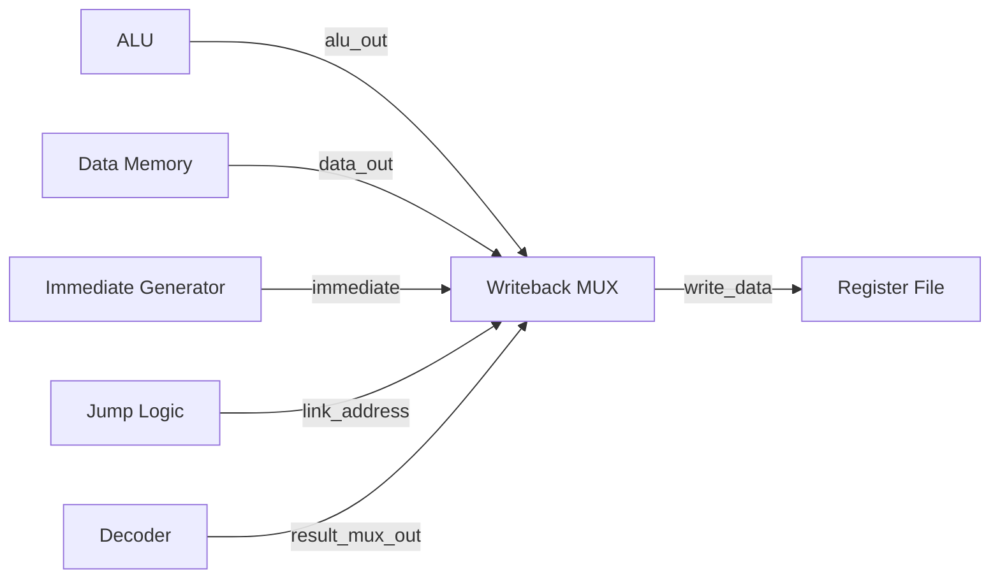

# Writeback MUX

The **Writeback MUX** is responsible for selecting the value that will be written back to the destination register (`rd`) in the Register File.

Different RV32I instructions obtain their final result from different sources. The Writeback MUX selects the required result based on the `result_mux_out` control signal generated by the Decoder.

## Module Interface

```verilog
module WRITEBACK_MUX(
    input wire [31:0] alu_out,
    input wire [31:0] data_out,
    input wire [31:0] immediate,
    input wire [31:0] link_address,
    input wire [1:0] result_mux_out,
    output reg [31:0] write_data
);
```

## Inputs

| Signal | Width | Description |
|---|---:|---|
| `alu_out` | 32 bits | Result generated by the ALU |
| `data_out` | 32 bits | Data read from Data Memory |
| `immediate` | 32 bits | Immediate value generated by the Immediate Generator |
| `link_address` | 32 bits | `PC + 4`, generated by the Jump Logic |
| `result_mux_out` | 2 bits | Selects the source used for writeback |

## Output

| Signal | Width | Description |
|---|---:|---|
| `write_data` | 32 bits | Final value written to the destination register |

## Result Selection

The `result_mux_out` signal selects one of four possible sources:

| `result_mux_out` | Selected Source | Used For |
|---|---|---|
| `2'b00` | `alu_out` | R-Type, I-Type, and AUIPC |
| `2'b01` | `data_out` | Load instructions |
| `2'b10` | `immediate` | LUI |
| `2'b11` | `link_address` | JAL and JALR |

## Operation

### ALU Result

When:

```text
result_mux_out = 2'b00
```

the Writeback MUX selects:

```text
write_data = alu_out
```

This is used by instructions whose result is calculated by the ALU.

Examples:

```text
ADD
SUB
AND
OR
XOR
SLT
SLTU
SLL
SRL
SRA
ADDI
SLLI
SLTI
SLTIU
XORI
SRLI
SRAI
ORI
ANDI
AUIPC
```

### Data Memory Result

When:

```text
result_mux_out = 2'b01
```

the Writeback MUX selects:

```text
write_data = data_out
```

This is used by load instructions:

```text
LB
LH
LW
LBU
LHU
```

The data is obtained from the Data Memory and then written into the destination register.

### Immediate

When:

```text
result_mux_out = 2'b10
```

the Writeback MUX selects:

```text
write_data = immediate
```

This is used by:

```text
LUI
```

For LUI, the U-Type immediate generated by the Immediate Generator is written directly to `rd`.

### Link Address

When:

```text
result_mux_out = 2'b11
```

the Writeback MUX selects:

```text
write_data = link_address
```

The link address is:

```text
PC + 4
```

This is used by:

```text
JAL
JALR
```

The selected value is written to the destination register so that the processor can return to the instruction following the jump.

## Datapath Role

The Writeback MUX is located between the result-producing units and the Register File.



The overall writeback path is:

```text
ALU result
      \
Data Memory
        \
Immediate -----> WRITEBACK MUX -----> Register File
        /
Link Address
```

## Examples

### R-Type

For:

```asm
ADD x3, x1, x2
```

the ALU produces the result:

```text
alu_out
```

The decoder selects:

```text
result_mux_out = 00
```

Therefore:

```text
write_data = alu_out
```

### Load

For:

```asm
LW x5, 8(x1)
```

the Data Memory produces:

```text
data_out
```

The decoder selects:

```text
result_mux_out = 01
```

Therefore:

```text
write_data = data_out
```

### LUI

For:

```asm
LUI x5, 0x12345
```

the Immediate Generator produces:

```text
0x12345000
```

The decoder selects:

```text
result_mux_out = 10
```

Therefore:

```text
write_data = immediate
```

### JAL

For:

```asm
JAL x5, 100
```

the Jump Logic produces:

```text
link_address = PC + 4
```

The decoder selects:

```text
result_mux_out = 11
```

Therefore:

```text
write_data = PC + 4
```

and this value is written to `x5`.

## Connection with Register File

The Writeback MUX output is connected to the `rd` input of the Register File:

```text
WRITEBACK_MUX
      |
      | write_data
      v
REG_FILE.rd
```

The destination register is selected using:

```text
rd_addr
```

and the write operation is controlled by:

```text
reg_write_out
```

from the Decoder.

## Verification

The associated testbench verifies all four writeback selections:

- ALU result
- Data Memory result
- Immediate
- Link address (`PC + 4`)

The Writeback MUX is verified independently before integration into the complete RV32I single-cycle processor.
